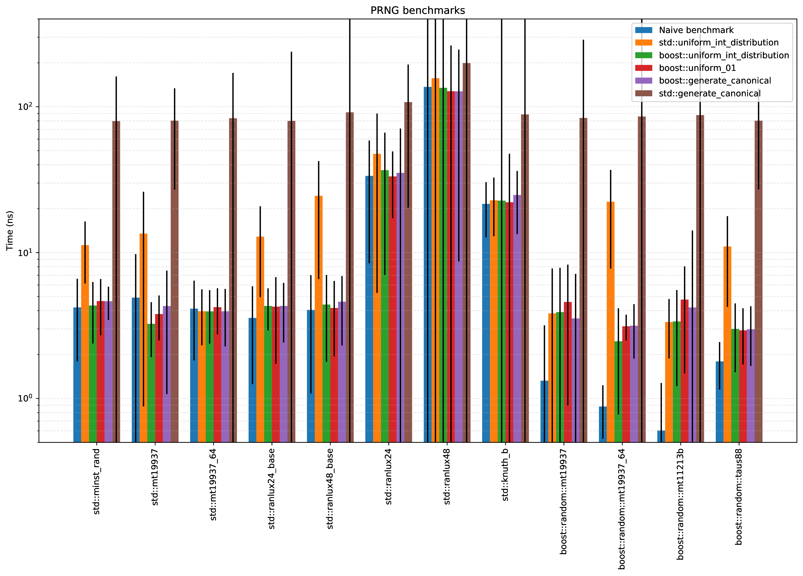
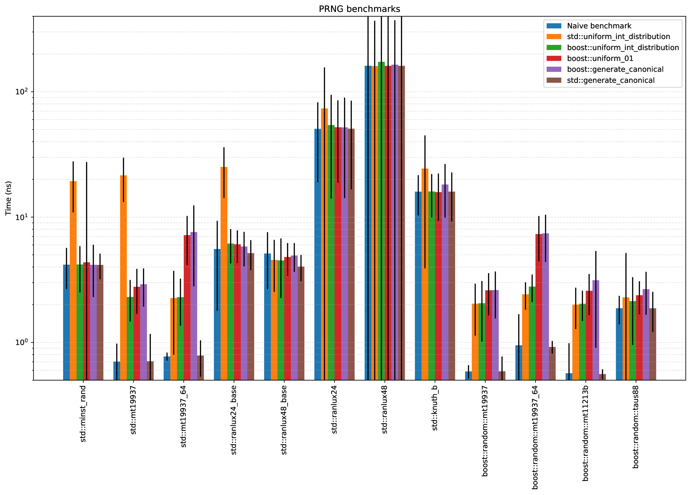

# PRNG Benchmarks

Simple benchmarks for the common C++ Pseudo Random Number Generators and
distributions.


## Results

On my laptop with Intel(R) Core(TM) i5-4210H CPU @ 2.90GHz, clang++ 10.0.1,
glibc 2.32-4, boost 1.72.0-2:



On my laptop with Intel(R) Core(TM) i5-4210H CPU @ 2.90GHz, g++ 10.2.0,
glibc 2.32-4, boost 1.72.0-2:



Smaller time means faster, but does not necessarily mean better. You should
also consider the period of each generator and and its "randomness quality".

Some comments about the Boost generators are available in
[their docs](https://www.boost.org/doc/libs/1_71_0/doc/html/boost_random/reference.html#boost_random.reference.generators).


## Compilation and usage

Requirements:
- a C++ compiler that implements C++17
- boost libraries 1.69 (or newer?)
- make

To compile the code, use the `Makefile`:

``` bash
$ make
$ ./benchmarks
```

The plotting script uses python3, matplotlib and pandas.

The simplest way to compile, run, and plot is with the helper script `run.sh`

``` bash
$ bash run.sh
```


## Contributing

Fork this repo, make your changes and open a Pull Request :)

Some ideas:
- benchmark more generators
- improve the plotting script
- add another benchmark
- refactor the code (it's quite ugly right now...)


## License

This project is licensed under GLP3 License - see the [LICENSE](LICENSE) file
for more details.